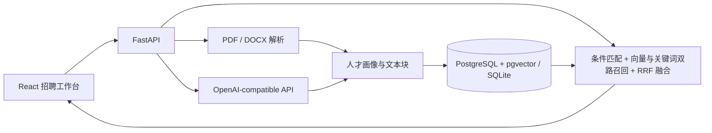

# 明猎智能问答系统

面向招聘负责人与技术面试展示的 RAG 人才问答工作台。在首页用自然语言描述想找的人，系统会结合最近会话理解条件，从本地简历库中检索、分析并返回候选人排序、优势、缺口和可追溯的简历原文。

> 匹配度用于缩小人才范围，不代表录用结论。系统不会使用性别、年龄、民族等敏感属性参与排名。

## 核心能力

- 批量导入文本型 PDF、DOCX，自动去重并展示异步处理进度。
- 将简历解析为候选人画像、工作经历和带来源位置的语义文本块。
- 将 JD 解析为岗位、行业、地域、年限、技能、管理经验和必要/优先条件。
- 以 35% 结构化匹配、45% 语义相关、20% 证据覆盖形成透明评分。
- **混合召回**：向量路（PostgreSQL 走 pgvector `<=>` 算子 + HNSW 索引）与关键词路各自召回，再用 RRF（倒数排名融合，k=60）合并。
- **LangGraph 编排（可选）**：`ORCHESTRATION_MODE=langgraph` 时走状态图「召回 → 召回质量评估 →（不够则自动改写查询重查，上限 2 轮）→ 生成」，界面上展示节点执行轨迹；任何节点失败自动退回固定流水线。
- 展示匹配依据、待核实缺口与原文证据；模型只做解释，不覆盖检索分数。
- 记录模型、耗时、Token、状态和请求哈希，不默认记录完整提示词。
- 提供离线 Mock 模式与**占位向量**，面试现场没有网络或 API Key 也能演示完整链路。
- 首页采用 Codex 式布局：左侧最近会话，右侧连续问答与推荐卡。

> **向量后端是可插拔的，并且会如实标注自己的状态。**
> 聊天与 embedding 是两套独立配置——DeepSeek 没有公开的 embedding 接口，所以未单独配置向量服务时，
> 系统使用本地确定性哈希占位向量。此时 45% 的「语义相关」权重不具语义含义，这一点会在
> `/api/health`、设置页与调用审计里显式标注为 `placeholder`，不会伪装成正常成功。
> 配置真实向量服务的方法见「评测与向量服务」一节。

## 架构



前端采用“人才雷达台”视觉语言：深墨蓝代表受控数据空间，矿物青表示可验证信号；匹配结果卡片把证据链放在中心，而非只展示一个黑箱分数。

## Docker 一键启动

1. 复制配置：

   ```bash
   cp .env.example .env
   ```

2. 修改 `.env` 中的 `SECRET_KEY`、`ADMIN_PASSWORD`。离线演示保持 `MODEL_MODE=mock`；使用云端聊天模型时设置：

   ```dotenv
   MODEL_MODE=deepseek
   CHAT_API_KEY=sk-your-deepseek-key
   CHAT_BASE_URL=https://api.deepseek.com
   CHAT_MODEL=deepseek-chat
   ```

   > **这个 Key 只能用于聊天，不能用于向量化。** DeepSeek 没有公开的 Embedding 接口，
   > embedding 必须单独配置一家（见「评测与向量服务」）。两者是独立配置，互不复用。
   > 请勿把 API Key 提交到 Git；`backend/.dockerignore` 已排除 `.env*`，防止 Key 被打进镜像。

3. 启动：

   ```bash
   docker compose up --build
   ```

   > `docker-compose.yml` 会用 `api.environment` 把 `DATABASE_URL` / `UPLOAD_DIR` 覆盖为
   > `postgres + /data/uploads`。所以根 `.env` 可以固定写 SQLite 供本机开发，
   > 本机与容器两条路共用一份配置，不需要手工切换。

4. 打开 `http://localhost:5173`。默认账号见 `.env`，首次进入前必须确认云端处理告知。

5. 可选：写入 16 位虚构演示候选人：

   ```bash
   docker compose exec api python -m scripts.seed_demo
   ```

API 文档位于 `http://localhost:8010/api/docs`，健康检查为 `GET /api/health`。

## 本机开发

后端：

```bash
cd backend
python -m venv .venv
.venv/Scripts/pip install -r requirements.txt
python -m app.bootstrap
.venv/Scripts/uvicorn app.main:app --reload --port 8010
```

> 根 `.env` 里 `DATABASE_URL` 默认已经是 `sqlite:///./minglie.db`，**不需要再手工 set**。
> `bootstrap` 现在只负责建表 / 建管理员 / 建上传目录，**不会重新解析已有简历**——
> 需要重建向量时请显式执行 `python -m scripts.reindex_embeddings`。

前端：

```bash
cd frontend
npm install
npm run dev
```

Vite 会把 `/api` 转发至 `http://localhost:8010`。SQLite 仅用于本地快速开发；Docker 交付使用 PostgreSQL + pgvector。

## 演示流程

1. 以管理员身份登录，确认数据处理告知。
2. 在“简历库”导入自己的已授权简历，或运行 `scripts.seed_demo`。
3. 打开“智能找人”（首页），直接输入一句自然语言需求，或使用 [半导体销售总监示例](docs/demo-jd.md)。
4. 检查系统提取的结构化条件，现场调整一个行业或技能标签，再追问一句继续筛选。
5. 对比推荐卡上的字段匹配、语义相关和证据覆盖三个分项分数。
6. 展开原文证据，再进入候选人档案查看经历时间线。
7. 打开“调用审计”，展示请求哈希、耗时、状态（含占位向量标记）和不保存正文的设计。
8. 打开“人才雷达”，展示人才库规模与最近岗位，作为收尾。

## 数据与安全边界

- 真实简历、数据库、日志、导出结果、`.env` 和 API Key 均被 Git 忽略。
- Docker 使用独立卷保存 PostgreSQL 数据和简历文件，服务重启后仍然存在。
- `MODEL_MODE=openai` / `deepseek` 会把简历原文发送给配置的聊天模型服务商；
  **配置了云端 embedding 服务后，简历原文同样会发送给向量服务商**。请确认候选人授权，
  并自行审查供应商的数据保留政策。仅做本地演示时建议保持 `EMBEDDING_PROVIDER=hash` 或使用本地模型，
  让原文不出本机。
- 云端结构化调用不把候选人敏感属性纳入排序；审计使用 SHA-256 请求指纹。
- 删除候选人会级联删除画像、经历、文本块、向量、匹配记录和本地原文件。
- 扫描版 PDF、旧版 `.doc` 和 OCR 不在首版范围内，界面会返回可操作的失败提示。

## 测试与评测

```bash
cd backend
.venv/Scripts/pytest -q

cd ../frontend
npm run build
npm test
```

### 评测结果

`backend/eval/gold.json` 提供不含真实个人信息的黄金集（schema v2：以**源文档 SHA-256** 作为稳定标识，
带 grade 1–3 分级相关度），`scripts/evaluate.py` 会真实跑一遍检索链路并计算
**Recall@K / MRR / NDCG@K**，结果落盘到 `eval/results*.json`。

语料：16 位虚构候选人 / 33 个文本块（`scripts/seed_demo.py`）；8 条评测样例；相关度阈值 grade ≥ 2。

| 指标 | 纯向量召回 `--fusion vector_only` | 向量 + 关键词 RRF 融合 `--fusion hybrid` | 变化 |
|---|---|---|---|
| Recall@5 | 0.67 | **0.77** | +0.10 |
| Recall@10 | 0.67 | **0.88** | +0.21 |
| MRR | 0.94 | 0.92 | −0.02 |
| NDCG@5 | 0.78 | **0.83** | +0.05 |
| NDCG@10 | 0.78 | **0.87** | +0.09 |

> ⚠️ **这组数字是在占位向量下测的**（见「评测与向量服务」）。所以它验证的是**召回策略**的收益，
> 不能代表语义检索的真实水平——指标最差的那条样例正好印证了这点：当 JD 缺少结构化字段时，
> 结构化分退化为常数，排序几乎只剩语义分在工作，而占位向量没有语义。
> 配置真实向量服务后重跑即可得到真实数字。
>
> MRR 下降 0.02 是保留在报告里的真实取舍：召回池变大后，个别样例的首位会被挤后一位。

#### 重排 A/B：规则 vs 大模型（负结果）

`RERANK_MODE` 决定由谁打那 20% 的相关度分：`rule` = 证据关键词覆盖率，`llm` = 一次批量大模型调用给 top-N 打 0–100 分。
用同一套黄金集对比的结果如下（两组除裁判外配置完全相同）：

| 指标 | `rule` | `llm` | 变化 |
|---|---|---|---|
| Recall@5 | **0.82** | 0.79 | −0.03 |
| NDCG@5 | **0.87** | 0.85 | −0.02 |
| NDCG@10 | **0.90** | 0.89 | −0.01 |

**结论：默认保持 `rule`。** 重排只占 20% 权重且只作用于 top-20，而此时 R@10 已接近饱和；
再加上输入排序本身受占位向量污染，裁判再准也救不回被挤在后面的候选人。
`llm` 作为开关保留（调用失败自动降级为 `rule`，界面显示实际生效的模式），
等真实 embedding 接上后重跑同一套脚本即可重新判定。

```bash
cd backend
.venv/Scripts/python -m scripts.evaluate --fusion vector_only --rerank rule --out eval/results_fusion_vector_only.json
.venv/Scripts/python -m scripts.evaluate --fusion hybrid      --rerank rule --out eval/results_hybrid.json
.venv/Scripts/python -m scripts.evaluate --fusion hybrid      --rerank llm  --out eval/results_rerank_llm_deepseek.json
.venv/Scripts/python -m scripts.evaluate --list-candidates    # 编写/更新黄金集时用
```

评测结束后会自动清理它创建的「【评测】」岗位与匹配记录，不污染演示数据（加 `--keep` 可保留）。

## 评测与向量服务

聊天模型与 embedding 是**两套独立配置**：DeepSeek 没有公开的 Embedding 接口，
所以向量化必须单独配一家（代码内置了国内常见服务商的预设）。

```dotenv
# 可选：hash / siliconflow / zhipu / dashscope / openai
EMBEDDING_PROVIDER=siliconflow
EMBEDDING_MODE=auto            # auto: 有 Key 走真实，无 Key 走占位
EMBEDDING_API_KEY=sk-xxxx
EMBEDDING_BASE_URL=             # 留空 = 用服务商预设
EMBEDDING_MODEL=                # 留空 = 用服务商预设（siliconflow 默认 BAAI/bge-m3，1024 维）
EMBEDDING_DIMENSIONS=0          # 0 = 用服务商原生维度
```

配置完成后**必须重建向量**（维度变了，旧向量会被检索跳过）：

```bash
cd backend
.venv/Scripts/python -m scripts.reindex_embeddings --dry-run        # 先看会做什么
.venv/Scripts/python -m scripts.reindex_embeddings --rebuild-index  # 重建并刷新 HNSW 索引
```

重建脚本是幂等、分批、可续跑的：它会对比 `.embedding-signature` 指纹自动判断是否需要全量重算；
Postgres 下会先把旧向量置 NULL 再 `ALTER COLUMN ... TYPE vector(N)`（顺序不能反）；
失败的块记入 `eval/reindex_failed.json`，可用 `--only-failed` 续跑。

配置是否生效可在三处确认：`GET /api/health` 的 `embedding_is_placeholder`、设置页的「向量检索」区块、
调用审计里 `向量生成` 那一行的状态（`placeholder` → `success`）。

## 项目结构

```text
backend/
  app/              API、模型、检索、解析与数据模型
  alembic/          数据库迁移
  scripts/          演示数据与评测脚本
  tests/            单元与 API 测试
frontend/
  src/pages/        招聘工作台页面
docs/               演示 JD
docker-compose.yml  本地/内网交付编排
```

## 后续路线

- ✅ **混合召回**（向量 + 关键词 RRF 融合）—— 已完成，附评测对比。
- ✅ **检索评测体系**（Recall@K / MRR / NDCG@K + 结果落盘）—— 已完成。
- ✅ **pgvector HNSW 索引**（迁移 `0002_hnsw_index`）—— 代码与迁移已就绪。
- ✅ **embedding 独立可插拔 + 占位状态可见**—— 已完成；无凭证时不再伪装成 success。
- ⏳ **真实向量服务接入** —— 链路已就绪，待填入服务商 Key 并重建向量。
- ✅ **可选大模型重排**（`RERANK_MODE=rule|llm`，批量打分、失败降级、模式可追溯）—— 已完成，并附 A/B；
  实测未超过规则打分，故默认关闭。见「重排 A/B」一节。
- ⏳ **本地 cross-encoder 重排** —— A/B 显示该场景「重排」确实是短板，但大模型裁判不是解法
  （杠杆只有 20% 且输入被占位向量污染）。接入真实 embedding、把召回做干净之后再重新评估。
- ⏳ OCR 与图片简历、Excel 批量字段映射。
- ⏳ 单份/多份简历的自由问答与对话引用。
- ⏳ 招聘顾问多人权限与岗位协作、企业 SSO 与数据保留策略。
- ⏳ 数据库访问改为 AsyncSession（当前是同步 `create_engine` + `sessionmaker`；异步的是后台任务层）。
